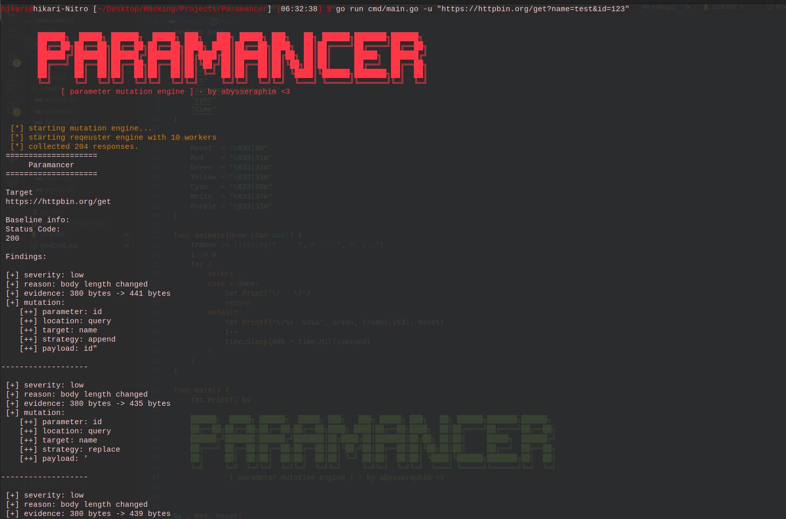

# Paramancer

```
██████╗  █████╗ ██████╗  █████╗ ███╗   ███╗ █████╗ ███╗   ██╗ ██████╗███████╗██████╗
██╔══██╗██╔══██╗██╔══██╗██╔══██╗████╗ ████║██╔══██╗████╗  ██║██╔════╝██╔════╝██╔══██╗
██████╔╝███████║██████╔╝███████║██╔████╔██║███████║██╔██╗ ██║██║     █████╗  ██████╔╝
██╔═══╝ ██╔══██║██╔══██╗██╔══██║██║╚██╔╝██║██╔══██║██║╚██╗██║██║     ██╔══╝  ██╔══██╗
██║     ██║  ██║██║  ██║██║  ██║██║ ╚═╝ ██║██║  ██║██║ ╚████║╚██████╗███████╗██║  ██║
╚═╝     ╚═╝  ╚═╝╚═╝  ╚═╝╚═╝  ╚═╝╚═╝     ╚═╝╚═╝  ╚═╝╚═╝  ╚═══╝ ╚═════╝╚══════╝╚═╝  ╚═╝
         [ parameter mutation engine ] · by abysseraphim <3
```

A concurrent HTTP parameter mutation engine for web application security testing.
Paramancer probes every parameter in a request — name and value — using systematic
mutations, then compares each response against a clean baseline to surface anomalies.
No scanner. No plugin. Just structured noise with a purpose.

---

## Why

Most parameter tampering is done by hand in Burp, one request at a time, or delegated
to a scanner that fires thousands of generic payloads and buries the signal in noise.

Paramancer sits in between: it takes a single request, extracts every parameter it
finds, and surgically mutates each one — appending, prepending, or replacing both the
name and the value — then flags anything that deviates from baseline behavior.

The goal is not to confirm vulnerabilities. The goal is to find the parameters that
**react** to unexpected input — the ones worth investigating manually.

This is especially useful for:

- **Error and stack trace hunting** — sending type-confusing or structurally broken
  values to see what the backend leaks in the response body or via status codes.
- **Business logic probing** — identifying which parameters influence server behavior
  beyond what their names suggest.
- **Pre-fuzzing recon** — narrowing down the attack surface before spending time on
  deeper manual testing.

---

## How it works

```
Input (URL or raw HTTP request)
        │
        ▼
   Parse & Extract Parameters
   (query / form / JSON body)
        │
        ▼
   Detect Types
   (string / number / boolean / UUID)
        │
        ▼
   Generate Mutations
   for each param × target × strategy × payload
        │
        ▼
   Send Baseline Request
        │
        ▼
   Send All Mutated Requests (concurrent workers)
        │
        ▼
   Compare Each Response to Baseline
   (status code + body length)
        │
        ▼
   Deduplicate & Report Findings
   (CLI + JSON output)
```

### Mutation model

For every parameter, Paramancer targets both the **name** and the **value**,
and applies three strategies:

| Strategy | Example (param: `id=123`, payload: `'`) |
|----------|------------------------------------------|
| append   | `id'=123` or `id=123'`                  |
| prepend  | `'id=123` or `id='123`                  |
| replace  | `'=123` or `id='`                       |

This covers a wide range of injection entry points without assuming what the
backend technology is.

### Payload set

```
'   "   [   ]   %00   %09   %0D   %0A
\t  \r  \n  \\  {{7*7}}  ${7*7}  []  null  NaN
```

These are chosen to trigger:
- SQL syntax errors (`'`, `"`)
- Array/type confusion (`[]`, `null`, `NaN`)
- Template injection (`{{7*7}}`, `${7*7}}`)
- Header injection (`%0D`, `%0A`, `\r`, `\n`)
- Null byte handling (`%00`)
- Encoding edge cases (`%09`, `\t`)

Both the percent-encoded and literal forms are included intentionally — some
backends decode once, some decode twice. Both versions in the payload set means
you catch both cases in a single run.

### Anomaly detection

Paramancer establishes a baseline by sending the original unmodified request first.
Then, for each mutated response, it checks:

- **Status code changed** — severity medium (high if 5xx). A backend that returns
  500 on a mutated parameter name is almost always leaking something useful.
- **Body length changed** — severity low. Length differences indicate the backend
  reflected, rejected, or processed the input differently. Worth investigating
  manually, especially when combined with specific payloads like `{{7*7}}` or `'`.

Findings are deduplicated per `(param, location, target, strategy)` — the first
payload that triggers an anomaly is reported, the rest are skipped. This keeps
output readable without hiding the signal.

---

## Error & stack trace hunting

One of the most underrated recon techniques is making a backend crash verbosely.
Stack traces, framework error pages, and unhandled exception messages leak:

- Framework and version (`Django 3.2`, `Laravel 9`, `Spring Boot 2.7`)
- Internal file paths (`/var/www/app/controllers/UserController.php`)
- Database query structure (sometimes the full query with your input in it)
- Class names and method signatures

Paramancer is built with this in mind. Payloads like `'`, `"`, `[]`, `null`,
and `NaN` are chosen specifically because they break type assumptions at the
application layer — not just the database layer.

A 500 response on `id[]=123` is a different bug than a 500 on `id=null`.
Both show up as `High` findings. Both are worth a manual follow-up.

---

## Usage

### URL mode

```bash
go run cmd/main.go -u "https://target.com/api/users?id=123&role=admin"
```

### Raw request mode

```bash
go run cmd/main.go -r request.txt -s https
```

Where `request.txt` is a raw HTTP request copied from Burp or your proxy:

```
POST /api/login HTTP/1.1
Host: target.com
Content-Type: application/json
Content-Length: 37

{"username":"admin","password":"test"}
```

Paramancer auto-detects the body format from `Content-Type` and extracts
parameters accordingly — query string, `application/x-www-form-urlencoded`,
and `application/json` are all supported.

### Flags

```
-u   Target URL (with query parameters)
-r   Path to raw HTTP request file
-s   Scheme to use with raw request: http or https
-t   Number of concurrent workers (default: 10)
```

---

## Output

Results are printed to the terminal and saved as a JSON file named after the target host.

```
[+] severity: high
[+] reason: status code changed
[+] evidence: status: 200 → 500 | value: "123" → "123'"
[+] mutation:
   [++] parameter: id
   [++] location: query
   [++] target: value
   [++] strategy: append
   [++] payload: 123'
```

The `payload` field in output always shows the **full resulting value** after
mutation — not just the injected character — so you can copy it directly into
Burp for follow-up.

JSON output includes baseline info, all findings, severity, evidence, and the
exact mutation that triggered each anomaly.

---

## Concurrency

Paramancer sends all mutated requests through a pool of concurrent goroutine workers.
The default is 10 workers, tunable with `-t`.

```
jobs channel  ──►  worker 1 ──► sender ──► results channel
               ──►  worker 2 ──► sender ──►
               ──►  worker 3 ──► sender ──►
               ...
               ──►  worker N ──► sender ──►
```

All mutated requests are queued into a buffered `jobs` channel. Workers pull from
it concurrently and push responses into a `results` channel. The main goroutine
collects all results after all workers are done, then runs detection and reporting.

This means a request with 3 parameters and 17 payloads (204 total mutations) finishes
in roughly the same time as 20 sequential requests, not 204.

Raise `-t` for targets that can handle the load. Lower it for rate-limited APIs.

---

## Sample JSON output

```json
{
  "Target": "https://target.com/api/users",
  "Baseline": {
    "URL": "https://target.com/api/users",
    "Method": "GET",
    "StatusCode": 200,
    "BodyLength": 380
  },
  "Findings": [
    {
      "Severity": "high",
      "Reason": "status code changed",
      "Evidence": "status: 200 → 500 | value: \"123\" → \"123'\"",
      "Parameter": "id",
      "ParamLocation": "query",
      "ParamTargetedPart": "value",
      "MutationStrategy": "append",
      "Payload": "123'"
    },
    {
      "Severity": "low",
      "Reason": "body length changed",
      "Evidence": "body: 380 → 441 bytes | name: \"id\" → \"id\\\"\"",
      "Parameter": "id",
      "ParamLocation": "query",
      "ParamTargetedPart": "name",
      "MutationStrategy": "append",
      "Payload": "id\""
    }
  ]
}
```
## Screenshot



The JSON file is saved automatically as `<host>.output.json` in the current directory.

---

## Current Limitations

- **No response body diffing** — detection is based on status code and body length only.
  A backend that returns 200 with an error message in the body will not be flagged.
  Follow up manually on interesting findings.

- **Flat JSON only** — the JSON extractor handles top-level key-value pairs.
  Nested objects and arrays are not recursively parsed. `{"user": {"id": 1}}` will
  not extract `id`.

- **No cookie or header parameter support** — only query string, form body, and JSON
  body parameters are extracted and mutated.

- **No WAF evasion** — payloads are sent as-is. If a WAF is blocking requests,
  Paramancer will not attempt to bypass it. Use `-t 1` to slow down and reduce
  detection surface.

- **Single baseline** — the baseline is captured once at startup. If the target
  has non-deterministic responses (randomized tokens, timestamps, dynamic content),
  body length comparisons will produce noisy findings.

- **No authentication handling** — session tokens must be included manually in the
  raw request file. There is no built-in login flow or token refresh.

---

## Build

```bash
git clone https://github.com/abysseraphim/paramancer
cd paramancer
go build -o paramancer cmd/main.go
./paramancer -u "https://target.com/search?q=test"
```

Requires Go 1.21+. No external dependencies.

---

## Architecture

```
paramancer/
├── cmd/
│   └── main.go          # entry point, flag parsing, worker orchestration
└── internal/
    ├── models.go         # all types: Request, Parameter, Mutation, Finding, Report
    ├── input.go          # CLI flag parsing, file reading
    ├── parser.go         # URL and raw HTTP request parsing, param extraction
    ├── mutator.go        # mutation generation (param × target × strategy × payload)
    ├── builder.go        # request construction for query / form / JSON
    ├── sender.go         # HTTP client, concurrent worker
    ├── analyzer.go       # response reading and normalization
    ├── detector.go       # baseline comparison, anomaly detection, deduplication
    └── report.go         # CLI output and JSON report generation
```

Each file has a single responsibility. The pipeline is linear and easy to extend —
adding a new detection heuristic means touching only `detector.go`, adding a new
body format means touching only `parser.go` and `builder.go`.

---

## Author

**Soroush Maleki** — Application Security Researcher

GitHub: [https://github.com/abysseraphim](https://github.com/abysseraphim)